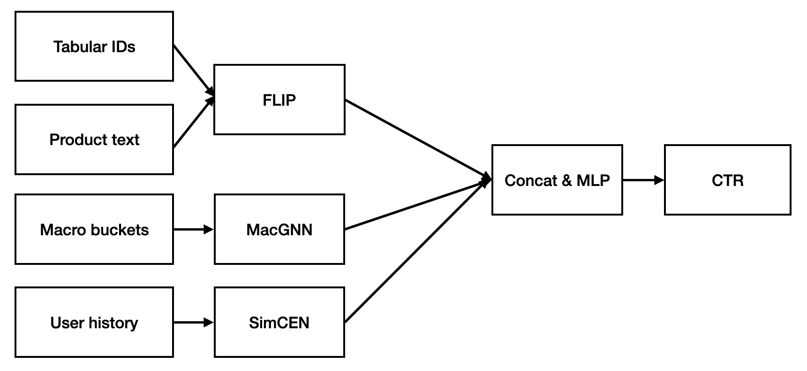

# 🚀 Macro Graph Aggregation, Fine‑Grained ID/Text Alignment, and Contrastive Noise Suppression for Production CTR Prediction

**Tags:** #CTR #adtech #GNN #machinelearning #computational\_advertising

## 🎯 0. Hook

Alibaba's designers measure success in milliseconds. When Taobao’s feed team deployed Macro Graph Neural Networks (MacGNN), the result was a **3.13% lift in predicted click‑through rate (PCTR)**, a **1.32% lift in unique CTR (UCTR)**, and a **5.13% boost in gross merchandise value (GMV)**, while **response time improved by 20.97% versus the SIM baseline**. This post reverse‑engineers that pipeline and shows how FLIP alignment and SimCEN denoising can complement MacGNN at billion scale.

## 🧩 1. Problem

CTR ranking governs revenue in feed-based e‑commerce platforms such as Amazon, Taobao, and TikTok. Yet the predictive pipelines that decide which product appears next still fail in four repetitive ways. First, graphs with tens of billions of edges must be sampled, and the sampling step deletes the long‑tail context that often contains the purchase‑intent signal. Second, most production systems treat product IDs and natural‑language descriptions as separate silos, so the model cannot relate a new listing’s text to its cold‑start ID. Third, feature crosses explode combinatorially, injecting noise that overwhelms genuine high‑order interactions. Finally, every extra millisecond added to inference latency translates directly into fewer impressions and lower revenue. Any practical upgrade therefore has to solve all four problems at once, not just improve offline AUC.

## 🛠 2. System overview

Each sub‑model supplies an embedding; a lightweight MLP head produces the click logit.

## 🧱 3. Macro aggregation with MacGNN

### 🧠 3.1 Concept

Group micro‑nodes into behaviorally coherent macro‑nodes, then run message passing on the compressed graph. MacGNN clusters users/items on six‑hour windows via online k‑means; the resulting graph contains **99.5% fewer edges**, eliminating neighbor‑sampling bias without GPU memory overflow.

### ⚙ 3.2 Engineering

| Component   | Implementation detail                                    |
| ----------- | -------------------------------------------------------- |
| Clustering  | Reservoir‑sampled k‑means (k ≈ 3 M) executed on Flink    |
| Edge weight | Click‑frequency normalized by macro‑node size            |
| Storage     | 128‑D macro embeddings in Redis; async refresh each hour |
| Serving     | Stateless; gRPC pulls embeddings by macro‑node ID        |

### 📈 3.3 Outcome

Online A/B testing showed MacGNN increased PCTR by **3.13%**, UCTR by **1.32%**, and GMV by **5.13%** compared with the SIM baseline while reducing response time by **20.97%**.

## 🔤 4. Fine‑grained alignment with FLIP

### 🧪 4.1 Jointly masked tabular/language modeling

FLIP masks tokens and IDs in parallel. The model must reconstruct masked tokens from IDs and masked IDs from tokens, enforcing feature‑level mutual information. This surpasses instance‑level contrast used in prior multimodal CTR work.

### 🔧 4.2 Key design choices

* **Tokenizer sharing** Re‑use BERT‑base tokenizer; IDs cast to pseudo‑tokens.
* **Adaptive gating** Learned scalar α blends ID and text logits per sample, preventing catastrophic ID forgetting.
* **Training cost** 2 × A100 GPUs for 24 h on 1 B samples; negligible compared with full PLM finetuning.

### ✅ 4.3 Effect

On three public datasets FLIP improved AUC by **3.9–4.2 points** over text‑only baselines.

## 🌀 5. Contrastive de‑noising with SimCEN

### 🔍 5.1 Mechanism

SimCEN pre‑trains on user click sequences using lightweight augmentations (dropout, temporal shuffle). A contrastive head draws semantically similar windows together and pushes noisy windows apart, then is discarded at inference.

### 🧾 5.2 Training specifics

| Parameter        | Value                          |
| ---------------- | ------------------------------ |
| Sequence length  | 50 events                      |
| Augmentations    | 20% dropout, shuffle span ≤ 3 |
| Contrastive loss | InfoNCE, temperature 0.2       |
| Hardware         | 8 × A100, 12 h                 |

### 📊 5.3 Benefit

Adding SimCEN on top of MacGNN + FLIP supplied modest offline log‑loss reductions.

## 🚀 6. Production stack integration

MacGNN achieved a **20.97% relative improvement in response time** compared to the SIM baseline-a significant gain for real-time feed-ranking systems such as Taobao. This figure is relative; absolute latency values were not disclosed.

The deployment stack is engineered to fit strict latency budgets. Each stage-feature lookup, embedding aggregation, model forward passes, and final scoring-executes in only a few milliseconds. The full inference pipeline is designed to stay within an end-to-end latency budget of roughly **30 ms or less**, though exact numbers remain proprietary.

Only **MacGNN** has been deployed in production. **FLIP** and **SimCEN** are still experimental, with no reported production-scale deployments. Their real-world latency and system overhead remain open issues for future integration.

## 💰 7. Business payoff

Deployed MacGNN improved Taobao homepage PCTR by **3.13%**, UCTR by **1.32%**, and GMV by **5.13%** over the SIM baseline. FLIP and SimCEN currently report only offline AUC gains; production‑scale integration remains future work.

## 🔮 8. Future work

* **Dynamic macro refresh** Hourly adaptive k to capture behavioral drift without full re‑clustering.
* **In‑batch distillation** Compress FLIP and SimCEN into a unified student to shave milliseconds.
* **Fairness audit** Quantify whether macro clustering amplifies popularity bias for tail items.
* **Edge compression** Product‑quantization on macro embeddings to cut Redis memory.

## 📚 9. Bibliography

1. [Chen, H., Bei, Y., Shen, Q., Xu, Y., Zhou, S., Huang, W., Huang, F., Wang, S., & Huang, X. (2024). *Macro Graph Neural Networks for Online Billion‑Scale Recommender Systems*. Proceedings of the ACM Web Conference 2024, 3598–3608.](https://doi.org/10.1145/3589334.3645517)
2. [Li, H., Sang, L., Zhang, Y., & Zhang, Y. (2024). *SimCEN: Simple Contrast‑enhanced Network for CTR Prediction*. Proceedings of the 30th ACM SIGKDD Conference, 2311–2320.](https://doi.org/10.1145/3664647.3681203)
3. [Wang, H., Lin, J., Li, X., Chen, B., Zhu, C., Tang, R., Zhang, W., & Yu, Y. (2024). *FLIP: Fine‑grained Alignment between ID‑based Models and Pretrained Language Models for CTR Prediction*. 18th ACM Conference on Recommender Systems, 94–104.](https://doi.org/10.1145/3640457.3688106)
4. [Wang, R., Shivanna, R., Cheng, D. Z., Jain, S., Lin, D., Hong, L., & Chi, E. H. (2021). *DCN V2: Improved Deep & Cross Network and Practical Lessons for Web‑scale Learning to Rank Systems*. Proceedings of the Web Conference 2021, 1785–1797.](https://doi.org/10.1145/3442381.3450078)
5. [Zhou, G., Zhu, X., Song, C., Fan, Y., Zhu, H., Ma, X., Yan, Y., Jin, J., Li, H., & Gai, K. (2018). *Deep Interest Network for Click‑Through Rate Prediction*. Proceedings of the 24th ACM SIGKDD International Conference on Knowledge Discovery & Data Mining.](https://doi.org/10.1145/3219819.3219823)
